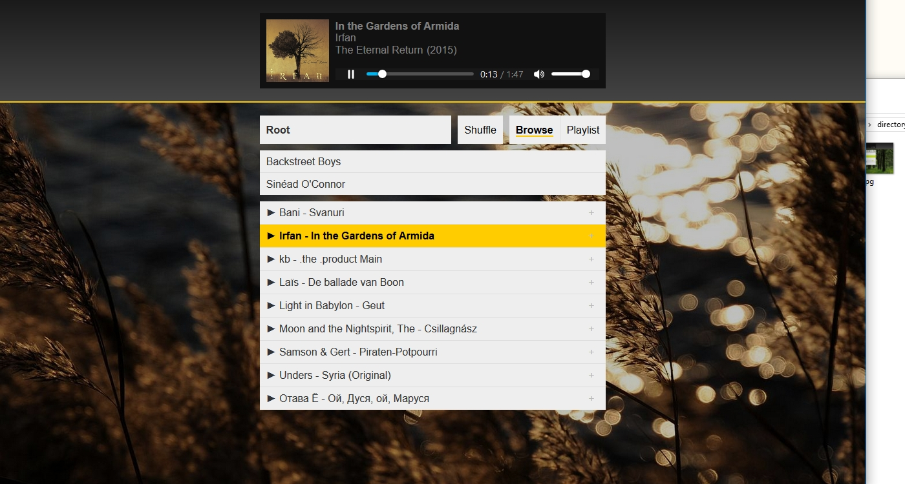
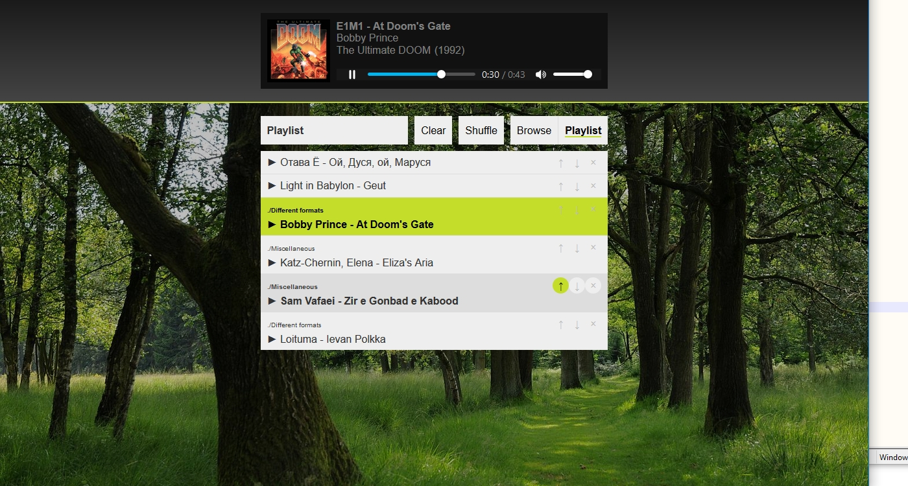
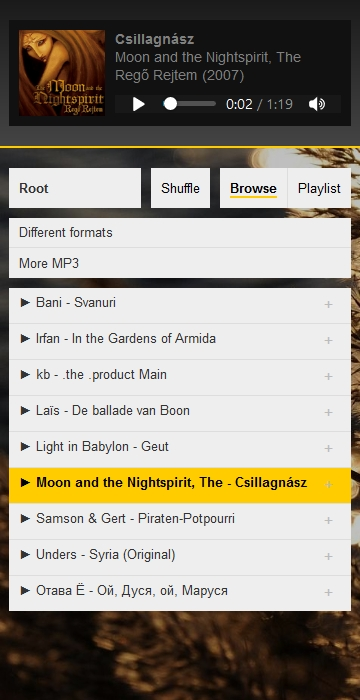
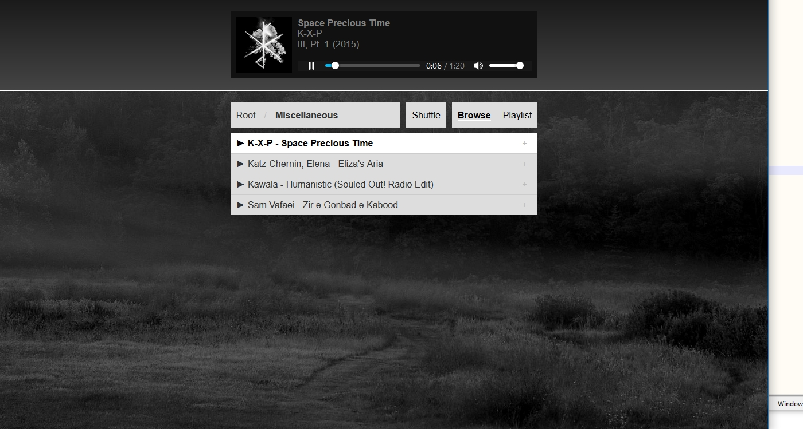

# Noctifer Music

Noctifer Music is a PHP/HTML5 script to turn any self-hosted audio library into a functional music player running within a browser. 

Try the [**live demo**](https://music.lrk.tools/demo) using the password 123.

The current version is 0.6.1. 

## Features

### Immediately enables folder-based playback

Simply drop `index.php` into any online directory that has audio files (and/or subdirectories containing audio files), and these files can be streamed immediately. The other files are optional, but recommended.

### Supports any format your browser does

Noctifer Music uses the HTML5 `audio` tag to serve the music. Thus, format support is entirely dependent on your browser. 

The [**live demo**](https://music.lrk.tools/demo) has a selection of common file formats available in the *Different formats* folder, so you can see what works in your browser. (The other folders contain MP3 files, which should work everywhere.)

### Metadata

The songs' metadata is read using James Heinrich's [getID3](https://github.com/JamesHeinrich/getID3). For most file formats, this includes artist, track title, album title, year, and album art.

### Custom playlist

Folder-based browsing is the default, but a custom selection of songs can be added to a playlist. The order of songs in the playlist can also be changed on the fly.

The playlist is saved in a cookie with a lifetime of one year.

### Shuffle

Shuffle mode can be toggled and will apply immediately to your current active song list, be it the current song's directory (if you selected a song to start playing from a directory) or your custom playlist (if you selected a song to start playing from the playlist). Shuffle goes through all songs once, before starting over with a newly shuffled list: when shuffle is on, repeat is also on.

### Uninterrupted playback while browsing or playlist editing

Browsing and playlist editing is implemented using AJAX calls, leaving the currently playing file unaffected. The page only reloads when a new file is loaded.

### Responsive design

The player adapts to smaller viewports and will work on your phone.

### Keyboard shortcuts and swipes

Noctifer Music uses the original WinAMP keyboard shortcuts, where

* `z` goes to the previous song;
* `x` plays/restarts the song*;
* `c` pauses/resumes the song;
* `v` stops the song*; and
* `b` advances to the next song.

*) These are implemented using `fastSeek`, which is not available on all browsers yet.

Additionally, `left` and `right` button presses also switch to the previous/next track.

On mobile, swiping left/right switches to the next/previous track.

### Password protection

Direct links to individual files will always play, but access to directory contents can be password-protected. 

### Different themes

Custom background images and colour schemes can be used. Aside from the above two themes, a third, dark theme is included by default.

## Usage

### Installation

It is recommended to have **PHP 7 or higher** available on your server. PHP 5 should work too, but has known issues with non-ASCII file names.

To install Noctifer Music, simply copy its files to a directory. It only needs to be copied once into the root of your library. The player can navigate subdirectories, but does not allow higher directories to be accessed.

Most importantly, copy `index.php`. Now, when accessing this directory using a browser, the player will show that directory's compatible contents, ready to be played.

Also copy `getID3` if you want metadata to be read. Otherwise, the player will merely show the filename and directory.

The `backgrounds` folder contains background images for the three included themes. Copy these to make everything look slightly more appealing.

### Configuration

`index.php` has a small number of variables at the beginning, allowing the player to be customised.

`$usepassword` allows password protection to be switched on (`true`) or off (`false`). When password protection is used, `$password` contains the plaintext password. This is a simple measure to block access; do not use a password you use anywhere else for this. 

`$allowedExtensions` is a case-insensitive array of allowed file extensions, determining which files are displayed in the list. By default, it contains `mp3`, `flac`, `wav`, `ogg`, `opus`, and `webm`. Currently, all of these can be played back in Chromium-based browsers and Firefox. Edge and Safari have significantly more limited support. Add or remove extensions from this list as needed.

`$excluded` is a case-sensitive blacklist of items (both files and directories) that should not be displayed when browsing.

In desktop mode, `$width` determines the width of the player as a percentage of the full window's width.

The variables `$background`, `$accentfg`, `$accentbg`, `$menubg`, `$menushadow`, `$gradient1`, `$gradient2` and `$filebuttonfg` take hexadecimal colour values to adjust the colour scheme of the player. `$backgroundimg` takes an image path for the background image; `$background` is only visible when no image is indicated. Three theme configurations are included; these can be commented/uncommented as desired. 

### Usage

One thing to note is the method of mode switching between **browse** and **playlist**. There is a difference between *view* and *playback* mode.

Playing songs in **browse playback mode** (or directory playback mode) means that songs are served from a specific directory. That is, if you start playing a song from a specific directory in browse mode, the next song will be the next song in that same directory. When shuffle is on, the next song will be a randomly selected one from that same directory.

Playing songs in **playlist playback mode** means that songs are served from the playlist. If you start playing a song from your playlist, the next song will be the next song in your playlist. When shuffle is on, the next song will be a randomly selected song from your playlist.

Clicking on either of the browse or playlist buttons switches to browse or playlist **view**. Only when a song is manually started from within browse or playlist view, does the player switch to the corresponding playback mode. This means that you can freely browse songs or edit your playlist without affecting the originally selected order of playback.

## Limitations

* A song can only be added once to a playlist. Adding it again will move it to the end of the list.
* There is only one playlist, and no option to export/import playlists. (It is saved only in a cookie.)
* It appears WEBM metadata is not read properly.
* Not all colours are represented as variables yet.
